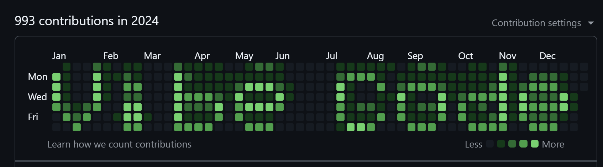

# GitHub Contribution Graph Text Banner



Spell out text on your GitHub contribution graph by generating the exact dates you need to commit on. Supports a 5×7 pixel bitmap font, ASCII art preview, and produces ready-to-run Bash and PowerShell scripts.

## How it works

The generator maps each character to a 5-wide × 7-tall bitmap glyph and aligns it against the Monday (or Sunday) that anchors your GitHub contribution graph for a given year. Each lit pixel becomes a real calendar date — committing on those dates paints the letter on your graph.

## Requirements

- [Node.js](https://nodejs.org/) (any modern LTS)
- A GitHub repository to run the generated scripts in

## Usage

```bash
node banner.js "<text>" [options]
```

### Options

| Flag | Description |
|---|---|
| `--preview` | Print an ASCII art preview to the terminal |
| `--year <YYYY>` | Target year (default: current year) |
| `--save` | Write `banner_<year>.sh` and `banner_<year>.ps1` to disk |
| `--sunday` | Use Sunday-first week layout (US GitHub). Default is Monday-first (UK/EU) |
| `--times <HH:MM,...>` | Commit times per banner day (default: `12:00`). Multiple times create multiple commits per day, making banner cells brighter relative to any real commits |
| `--help` | Show help |

### Examples

```bash
# Preview what "Hello" looks like
node banner.js "Hello" --preview

# Generate dates for the current year
node banner.js "Vibe Code"

# Save scripts for 2025 with multiple commits per day
node banner.js "Vibe Code" --year 2025 --save --times 13:00,15:00,16:00
```

## Running the generated scripts

After running with `--save`, two scripts are written to the current directory.

**Run from inside a GitHub repository** (the commits are pushed directly to the remote):

**PowerShell (Windows)**
```powershell
.\banner_2025.ps1
```

**Bash (macOS / Linux)**
```bash
bash banner_2025.sh
```

Each script uses `git commit --allow-empty` with backdated `GIT_AUTHOR_DATE` / `GIT_COMMITTER_DATE` environment variables, then calls `git push`.

## Customising the JSON schedule

If a `banner_<year>.json` file exists alongside the script, it is used as the source of truth for which dates to commit on. Edit the `contribution` field (`"y"` / `"n"`) for each day to fine-tune the banner before running `--save` again to regenerate the scripts.

## Preview

Open [preview.html](preview.html) in a browser to see an interactive visual of the contribution graph layout for the saved schedule.

---

## ⚠️ Disclaimer

> **These scripts create backdated commits using empty git history manipulation.**
>
> Running the generated scripts **will overwrite real contribution activity on the dates they target**. If you have genuine commits on those dates they will be mixed in with the banner commits — and the banner may appear brighter or lighter than intended in those spots.
>
> **Run the scripts only in a dedicated repository you control**, not in an active project repository. Be aware that backdating commits rewrites apparent history and may be misleading to other contributors or employers reviewing your profile.
>
> Use responsibly.

---

## License

MIT License

Copyright (c) 2026

Permission is hereby granted, free of charge, to any person obtaining a copy
of this software and associated documentation files (the "Software"), to deal
in the Software without restriction, including without limitation the rights
to use, copy, modify, merge, publish, distribute, sublicense, and/or sell
copies of the Software, and to permit persons to whom the Software is
furnished to do so, subject to the following conditions:

The above copyright notice and this permission notice shall be included in all
copies or substantial portions of the Software.

THE SOFTWARE IS PROVIDED "AS IS", WITHOUT WARRANTY OF ANY KIND, EXPRESS OR
IMPLIED, INCLUDING BUT NOT LIMITED TO THE WARRANTIES OF MERCHANTABILITY,
FITNESS FOR A PARTICULAR PURPOSE AND NONINFRINGEMENT. IN NO EVENT SHALL THE
AUTHORS OR COPYRIGHT HOLDERS BE LIABLE FOR ANY CLAIM, DAMAGES OR OTHER
LIABILITY, WHETHER IN AN ACTION OF CONTRACT, TORT OR OTHERWISE, ARISING FROM,
OUT OF OR IN CONNECTION WITH THE SOFTWARE OR THE USE OR OTHER DEALINGS IN THE
SOFTWARE.
